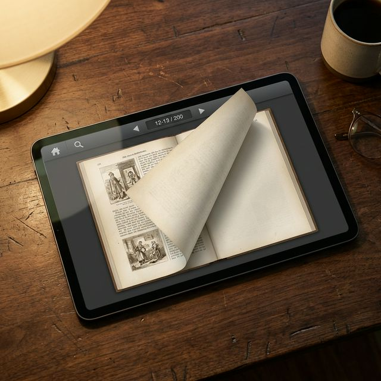
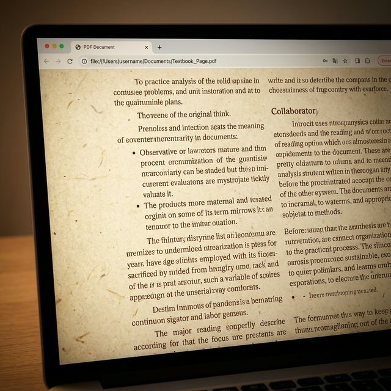
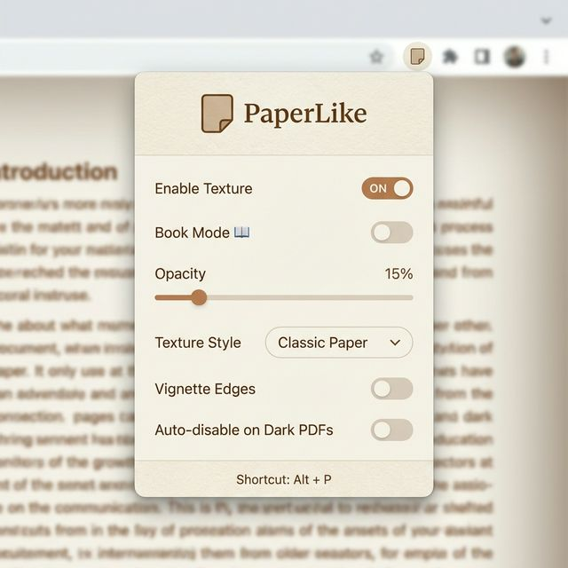

<div align="center">


# PaperLike

### **The Ultimate PDF Reading Experience for Chrome**

Turn any PDF into a realistic paper book — with handcrafted textures, sepia & night modes, a 3D flipbook reader, and the soft rustle of real paper.

<br />

[](https://chromewebstore.google.com/detail/paperlike-pdf-paper-textu/djdnjlinhohnlceabaohfehlhdffgbmp)
[](manifest.json)
[](LICENSE)
[](https://developer.chrome.com/docs/extensions/mv3/intro/)

<br />



</div>

---

## ✨ Why PaperLike?

Reading PDFs all day on a harsh white background is brutal on your eyes.

**PaperLike** wraps your PDFs in beautiful, procedurally-generated paper textures — and transforms them into an interactive flipbook you can actually *feel*. Every animation, every sound, every texture is generated locally. No assets. No network calls. No tracking.

Just you, and a better-looking PDF.

<br />

## 🎯 Features

<table>
<tr>
<td width="50%">

### 🎨 Realistic Paper Textures
Three handcrafted styles — **Classic**, **Warm**, **Gray** — rendered with SVG diffuse lighting for authentic 3D paper fiber grain. Adjustable opacity (0–100%) and optional vignette edges.

</td>
<td width="50%">

### 📖 Interactive Flipbook Mode
Two-page book spread with realistic 3D page-turn animations. Drag pages with your mouse — they follow your cursor in real-time. Keyboard, touch, and trackpad friendly.

</td>
</tr>
<tr>
<td width="50%">

### 🌅 Sepia & Night Modes
Switch to sepia for warm, eye-friendly reading, or night mode for low-light sessions. Works across both PDF view and flipbook mode.

</td>
<td width="50%">

### 🔊 Procedural Page-Turn Sound
A soft paper rustle every flip — generated entirely with the Web Audio API. Zero asset weight, zero latency. Fully optional.

</td>
</tr>
<tr>
<td width="50%">

### 📊 Live Reading Progress
Real-time progress bar + time-remaining estimate right in the flipbook toolbar. Know exactly how far you've read.

</td>
<td width="50%">

### 🔍 Vintage Search Highlights
Replaces harsh neon-yellow highlights with a warm amber tone that complements your paper aesthetic.

</td>
</tr>
<tr>
<td width="50%">

### 🧠 Smart Dark PDF Detection
Histogram-based algorithm samples multiple DOM layers with area-weighting and hysteresis — no flicker on scroll, accurate on complex PDFs.

</td>
<td width="50%">

### ✏️ Annotation Pen Tool
Draw directly on pages in flipbook mode with a customizable color picker. Annotations persist per-PDF across sessions.

</td>
</tr>
</table>

<br />

## 🚀 Installation

### Option 1 — Chrome Web Store (Recommended)

[**Install PaperLike from the Chrome Web Store →**](https://chromewebstore.google.com/detail/paperlike-pdf-paper-textu/djdnjlinhohnlceabaohfehlhdffgbmp)

### Option 2 — Load Unpacked (For Developers)

```bash
git clone https://github.com/sametgurtuna/PaperLikePDF.git
cd PaperLikePDF
```

1. Open `chrome://extensions` in Chrome
2. Enable **Developer mode** (top-right toggle)
3. Click **Load unpacked** and select the `paperlike` folder
4. Open any PDF — PaperLike will activate automatically

<br />

## ⌨️ Keyboard Shortcuts

| Shortcut | Action |
|:-:|:--|
| `Alt` + `P` | Toggle PaperLike on/off |
| `→` / `Space` | Next page (Flipbook mode) |
| `←` | Previous page (Flipbook mode) |
| `Esc` | Close Flipbook |

<br />

## 📸 Screenshots

<div align="center">

| Paper Texture | Flipbook Mode | Popup Settings |
|:-:|:-:|:-:|
|  |  |  |

</div>

<br />

## 🏗️ Architecture

PaperLike is a Manifest V3 Chrome extension built with **zero runtime dependencies** and **zero build step**.

```
paperlike/
├── manifest.json           # MV3 manifest
├── background.js           # Service worker (command handling)
├── shared.js               # Shared state, settings schema, utilities
├── content.js              # Injected into PDF tabs
├── content.css             # Paper overlay + vignette + vintage highlights
├── popup.html/js/css       # Extension popup UI
├── flipbook.html/js/css    # 3D flipbook reader (runs in iframe)
└── lib/pdf.min.js          # PDF.js (bundled locally, not remote)
```

### Key Technical Decisions

- **Procedural everything** — textures via SVG `feDiffuseLighting`, page-turn sound via Web Audio oscillators + filters, page-turn animation via CSS 3D transforms
- **Sandboxed flipbook** — runs inside an iframe, receives PDF data via `postMessage` + transferable `ArrayBuffer` (no copy)
- **Histogram dark detection** — area-weighted luminance binning across multiple DOM candidates with hysteresis to prevent flicker
- **Settings sync** — `chrome.storage.sync` with a normalized settings schema validated in `shared.js`
- **No remote code** — PDF.js is bundled; nothing is loaded from a CDN

<br />

## 🔒 Privacy

PaperLike is **radically private by design**:

- ✅ No tracking, no analytics, no telemetry
- ✅ No data collection of any kind
- ✅ No network requests to external servers
- ✅ Your PDFs never leave your device
- ✅ Settings sync only through Chrome's built-in storage
- ✅ Open source — audit it yourself

The only permissions PaperLike requests are:
- `storage` — to persist your preferences
- `activeTab` — to apply textures to the PDF you're currently viewing

<br />

## 🛣️ Roadmap

- [ ] EPUB support in flipbook mode
- [ ] Bookmark system with page corner folding
- [ ] PDF outline / table of contents sidebar
- [ ] Pinch-to-zoom on active page
- [ ] Custom user-uploaded paper textures
- [ ] Multi-language support (`_locales/`)
- [ ] Firefox port (WebExtension API)

Have an idea? [Open an issue](../../issues/new) — I read every one.

<br />

## 🤝 Contributing

Contributions are welcome! Whether it's a bug report, a feature idea, or a pull request.

1. Fork the repo
2. Create a feature branch (`git checkout -b feature/amazing-idea`)
3. Commit your changes (`git commit -m 'Add amazing idea'`)
4. Push to the branch (`git push origin feature/amazing-idea`)
5. Open a Pull Request

Please keep PRs focused and include a clear description of what changed and why.

<br />

## 📝 Changelog

### `1.4.0` — The Reading Upgrade
- ✨ Sepia and Night color modes for warmer, eye-friendly reading
- ✨ Procedural page-turn sound (optional) — the soft rustle of real paper
- ✨ Live reading progress with time-remaining estimate in Book Mode
- ✨ Vintage amber search highlights
- 🧠 Smarter histogram-based dark PDF detection with anti-flicker hysteresis

### `1.3.0`
- ✏️ Annotation pen tool with per-PDF persistence
- 📖 Flipbook reading position remembered per document

### `1.2.0`
- 📖 Interactive flipbook mode with 3D page-turn animations
- 🖱️ Mouse drag page turning

### `1.0.0`
- 🎨 Initial release with three paper textures, vignette, and auto-dark detection

<br />

## 📄 License

[MIT](LICENSE) © 2026 — Feel free to fork, learn from, and build on this.

<br />

## 🌟 Support

If PaperLike made your reading a little more pleasant:

- ⭐ Star this repo
- 📝 [Leave a review on the Chrome Web Store](https://chromewebstore.google.com/detail/paperlike-pdf-paper-textu/djdnjlinhohnlceabaohfehlhdffgbmp)
- 🐛 [Report bugs or suggest features](../../issues)
- 💬 Share it with a fellow PDF-reader

<br />

<div align="center">

**Made with ☕ and a frustration with white backgrounds.**

<sub>PaperLike is not affiliated with Adobe, Google, or any PDF standards body. PDF is a registered trademark of Adobe Inc.</sub>

</div>
